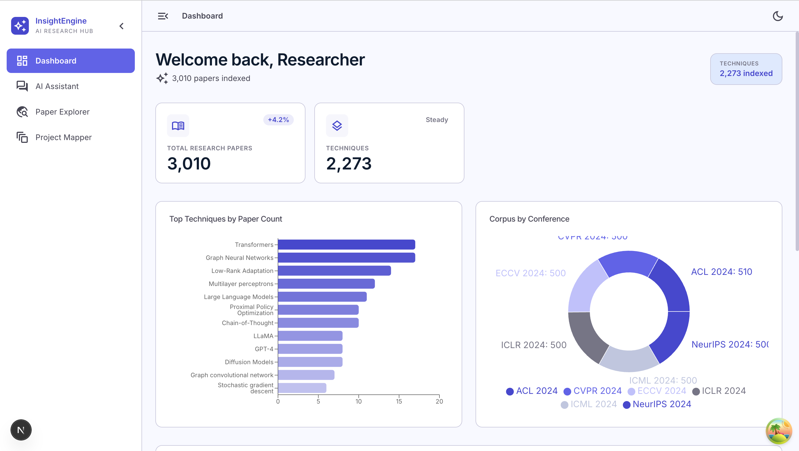
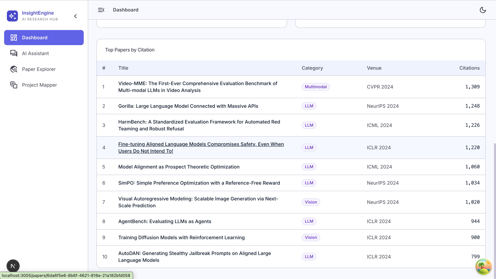

# Research Intelligence Platform

A self-hosted system for building a queryable knowledge base from academic paper corpora. Ingest papers from major ML/AI conferences, normalize entities across publications, run hybrid keyword + semantic search, and map your own project's components against the literature.

<p align="center">
  
  
  
  
  
</p>

---

## Why this exists

This project started as an attempt to build a structured research corpus that could support search, analytics, and retrieval-driven assistants from the same underlying data. The Feature Mapper came out of a specific need: given a system being built, which papers are actually relevant to each component, and where are the gaps?

---

## Screenshots

### Dashboard


*Corpus stats at a glance — total papers, techniques indexed, top techniques by paper count, and conference distribution.*

### AI Assistant

*RAG-powered chat grounded in the corpus. Answers cite specific papers with relevance scores, conference, and citation counts in a live source panel.*

### Paper Explorer


*Full-text + semantic search across 3,010 papers. Filter by venue (NeurIPS, ICLR, ICML, CVPR, ACL) and technique. Per-paper AI analysis with methodology, findings, strengths, and related papers.*

### Project Mapper


*Paste any README, PRD, or architecture doc — each component is extracted and mapped to the most relevant papers in the corpus.*

---

## Current corpus

The ingestion pipeline covers papers from:

- NeurIPS, ICML, ICLR
- CVPR, ECCV
- ACL, EMNLP, NAACL
- AAAI, IJCAI

Additional conferences can be added through `ingestion/conferences_config.py`. The current focus is 2023–2024 proceedings from the venues above.

---

## Repository contents

The repository contains code, schemas, migrations, and deployment assets only.

**Not included in Git:**
- `research_platform.db` — the SQLite corpus database
- `embeddings.index` — the FAISS vector index
- `embeddings_ids.json` — index-to-paper ID mapping

These must be generated locally (`python db/migrate.py` then `python scripts/build_embeddings.py`) or copied from an existing instance.

---

## Architecture

```
Browser
  │
  ├── HTTPS ──► Vercel ──► Next.js (React Query + SSE)
  │                               │
  │                               │ NEXT_PUBLIC_API_URL
  │                               ▼
  └── HTTPS ──► Cloudflare Tunnel ──► FastAPI (uvicorn)
                                           │
                             ┌─────────────┼─────────────┐
                             ▼             ▼             ▼
                        SQLite DB     FAISS index    LLM provider
                        (WAL mode)  (384-dim FlatIP) (Anthropic /
                                                      Gemini)
```

SQLite runs in WAL mode and handles the corpus, FTS5 index, graph tables, and Feature Mapper results. The FAISS index is built separately and loaded at startup.

---

## Features

### Ingestion and normalization

Papers are fetched from OpenReview and Semantic Scholar. Entity canonicalization resolves technique aliases (LoRA, DPO, CoT, SFT, and variants) to a single canonical name. An FTS5 full-text index is kept in sync with each ingestion run.

### Hybrid retrieval

Search fuses BM25 keyword scoring with FAISS dense vector search (all-MiniLM-L6-v2). The FAISS index stores per-field chunks — title, abstract, methodology, contributions, limitations — and aggregates back to paper level by max-pooling. Three signals are combined using Weighted Reciprocal Rank Fusion:

| Signal | Weight |
|---|---|
| Dense semantic (FAISS cosine) | 1.0 |
| Technique name match (FTS5 exact lookup) | 1.4 |
| Category match | 0.7 |

Technique matching gets the highest weight because an exact name match is a stronger signal than abstract similarity.

### Streaming chat

A research assistant over the corpus, served via Server-Sent Events. The frontend receives sources before the first token arrives. Referential follow-ups ("tell me more about the third paper") are resolved by anchoring to the prior user turn before retrieval.

### Feature Mapper

Give it any technical document — README, spec, PRD — and it maps each component to the most relevant papers in your corpus. Results are persisted to the database (`fm_projects`, `fm_features`, `fm_paper_matches`, `fm_recommendations`) and can be revisited without re-running the analysis.

The pipeline:

1. Split document into heading-delimited sections
2. Single LLM call extracts discrete features as structured JSON (name, type, raw terms)
3. Raw terms are normalized against the corpus vocabulary via FTS5 entity lookup
4. Each feature runs retrieval in parallel (dense + technique + category, RRF fusion)
5. Single merged LLM call per feature produces relevance explanations and research recommendations
6. Each feature gets a coverage tier: `strong` / `moderate` / `weak` / `novel`

`novel` means nothing close was found in the corpus — possibly worth writing up.

```
POST /api/v1/feature-map/analyze
{"text": "..."}
→ { project_id, features: [{ coverage_tier, papers, recommendations }] }
```

Minimum input: 50 words.

### Graph analytics

Co-citation and co-authorship graphs with centrality metrics. Entity co-occurrence graph across techniques, datasets, and categories. Cluster assignment and community detection. Corpus intelligence outputs include trend analysis, technique evolution, and emerging topic detection.

---

## Repository structure

```
├── api/               FastAPI app — routers, models, middleware
├── apps/web/          Next.js 15 frontend
├── db/                SQLAlchemy models, migrations, seeds
├── feature_mapper/    Feature Mapper pipeline (parser → retrieval → LLM)
├── search/            FAISS index, FTS5, hybrid retrieval
├── graph/             Graph builder, analytics, explainer
├── ingestion/         OpenReview + Semantic Scholar fetch, store
├── normalize/         Entity canonicalization rules and alias JSON
├── corpus_intel/      Trend analysis, technique evolution, emerging topics
├── notebooklm/        NotebookLM integration pipeline (paper synthesis)
├── llm/               Provider abstraction (Anthropic / Gemini)
├── scripts/           Build FAISS index, retrieval benchmarks
└── deploy/            Cloudflare Tunnel setup, nginx config, runbook
```

---

## Quick start

**Prerequisites:** Python 3.11+, Node.js 20+, an Anthropic or Gemini API key.

```bash
# 1. Install
git clone https://github.com/your-username/research-intelligence-platform.git
cd research-intelligence-platform
python3 -m venv .venv && source .venv/bin/activate
pip install -r requirements.txt
cd apps/web && npm install && cd ../..

# 2. Configure
cp .env.example .env
# Set DATABASE_URL, LLM_PROVIDER, and your API key

# 3. Initialize database
python db/migrate.py

# 4. Build FAISS index (required before search and Feature Mapper work)
python scripts/build_embeddings.py

# 5. Start backend
uvicorn api.main:app --reload --port 8000

# 6. Start frontend
cd apps/web && npm run dev
# http://localhost:3000
```

### Key environment variables

| Variable | Description |
|---|---|
| `DATABASE_URL` | `sqlite:///research_platform.db` or a PostgreSQL URL |
| `LLM_PROVIDER` | `anthropic` or `gemini` |
| `ANTHROPIC_API_KEY` | Required if using Anthropic |
| `ANTHROPIC_BASE_URL` | Optional LiteLLM proxy. Leave blank to hit `api.anthropic.com` |
| `GEMINI_API_KEY` | Required if using Gemini |
| `CORS_ORIGIN` | Exact frontend origin in production |
| `NEXT_PUBLIC_API_URL` | Full API base URL, baked into the Vercel build |
| `API_DEV_MODE` | Set to `1` to expose `/docs` and `/redoc` |

---

## Deployment

### Vercel + Cloudflare Tunnel

Frontend on Vercel, backend running locally, exposed via Cloudflare Tunnel. No VPS needed for a demo setup.

```bash
cloudflared tunnel create rip-backend
cloudflared tunnel route dns rip-backend api.yourdomain.com
sudo cloudflared service install
bash deploy/start-backend.sh
cd apps/web && vercel --prod
```

Set the Cloudflare proxy read timeout to 300 seconds (Dashboard → Network → Proxy Read Timeout). The Feature Mapper can take longer than the default timeout for large documents.

Full step-by-step: [`deploy/RUNBOOK.md`](deploy/RUNBOOK.md)

### Docker Compose

```bash
scp research_platform.db embeddings.index embeddings_ids.json user@vps:~/rip/
cp .env.example .env.production  # edit values
docker compose --env-file .env.production up -d --build
```

Minimum VPS: 4 vCPU, 8 GB RAM, 40 GB disk. Full checklist: [`deploy/DEPLOYMENT_CHECKLIST.md`](deploy/DEPLOYMENT_CHECKLIST.md)

---

## Limitations

- SQLite works well for personal or small-team use. For higher concurrency, PostgreSQL migration SQL is in `db/migrations/`.
- `NEXT_PUBLIC_API_URL` is baked at Vercel build time. Changing the tunnel URL requires a frontend redeploy.
- Feature Mapper latency scales with the number of features and LLM throughput.
- The machine running the backend must stay awake for the Cloudflare Tunnel deployment to work.

---

## Roadmap

**Cross-paper synthesis** — after Feature Mapper retrieval, aggregate methodology patterns, evaluation benchmarks, and open questions across the retrieved set. Fast path uses cached `paper_analyses`; live path routes through NotebookLM.

**Graph-grounded recommendations** — surface papers strongly connected to the retrieved set in the co-citation graph, catching adjacent work that keyword and semantic search miss.

**Incremental corpus expansion** — scheduled pipeline for new conference proceedings: delta ingestion, incremental re-embedding, graph edge updates.

---

## Tech stack

| | |
|---|---|
| Backend | FastAPI, uvicorn, SQLAlchemy 2.0 |
| Database | SQLite WAL + FTS5 (PostgreSQL migration path) |
| Vector search | FAISS FlatIP, 384-dim |
| Embeddings | sentence-transformers/all-MiniLM-L6-v2 |
| LLM | Anthropic Claude (native SDK), Google Gemini 2.5 Flash |
| Frontend | Next.js 15 App Router, React Query, Zustand, SSE |
| Graph | NetworkX |
| Deployment | Docker Compose, nginx, Vercel, Cloudflare Tunnel |

---

## License

MIT. See [`LICENSE`](LICENSE).
